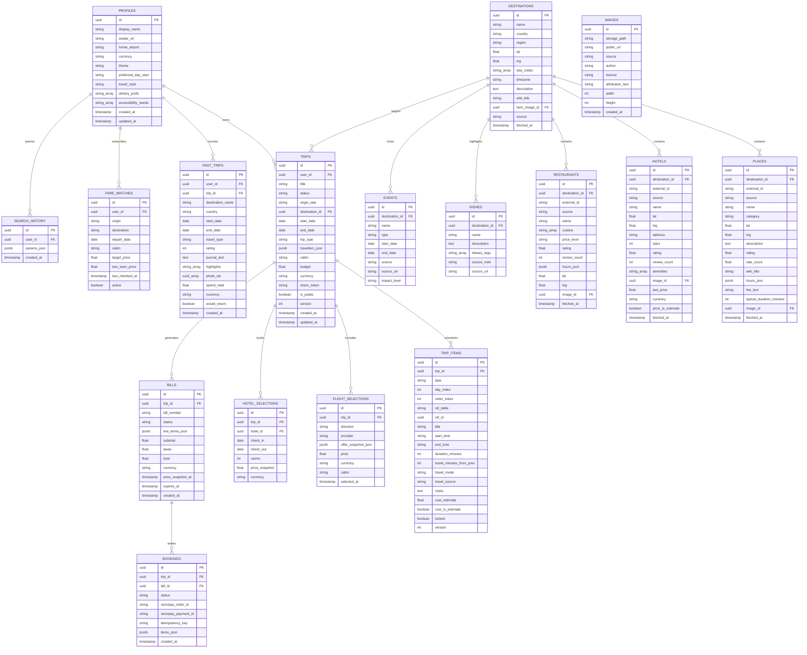

# TripWise Database Entity-Relationship Diagram

```mermaid
erDiagram
    PROFILES ||--o{ TRIPS : owns
    PROFILES ||--o{ PAST_TRIPS : records
    PROFILES ||--o{ FARE_WATCHES : subscribes
    PROFILES ||--o{ SEARCH_HISTORY : queries
    DESTINATIONS ||--o{ PLACES : contains
    DESTINATIONS ||--o{ HOTELS : contains
    DESTINATIONS ||--o{ RESTAURANTS : contains
    DESTINATIONS ||--o{ DISHES : highlights
    DESTINATIONS ||--o{ EVENTS : hosts
    DESTINATIONS ||--o{ TRIPS : targets
    TRIPS ||--o{ TRIP_ITEMS : schedules
    TRIPS ||--o{ FLIGHT_SELECTIONS : includes
    TRIPS ||--o{ HOTEL_SELECTIONS : books
    TRIPS ||--o{ BILLS : generates
    BILLS ||--o{ BOOKINGS : settles

    PROFILES {
        uuid id PK
        string display_name
        string avatar_url
        string home_airport
        string currency
        string theme
        string preferred_day_start
        string travel_style
        string_array dietary_prefs
        string_array accessibility_needs
        timestamp created_at
        timestamp updated_at
    }

    DESTINATIONS {
        uuid id PK
        string name
        string country
        string region
        float lat
        float lng
        string_array iata_codes
        string timezone
        text description
        string wiki_title
        uuid hero_image_id FK
        string source
        timestamp fetched_at
    }

    PLACES {
        uuid id PK
        uuid destination_id FK
        string external_id
        string source
        string name
        string category
        float lat
        float lng
        text description
        float rating
        float rate_score
        string wiki_title
        jsonb hours_json
        string fee_text
        int typical_duration_minutes
        uuid image_id FK
        timestamp fetched_at
    }

    HOTELS {
        uuid id PK
        uuid destination_id FK
        string external_id
        string source
        string name
        float lat
        float lng
        string address
        int stars
        float rating
        int review_count
        string_array amenities
        uuid image_id FK
        float last_price
        string currency
        boolean price_is_estimate
        timestamp fetched_at
    }

    RESTAURANTS {
        uuid id PK
        uuid destination_id FK
        string external_id
        string source
        string name
        string_array cuisine
        string price_level
        float rating
        int review_count
        jsonb hours_json
        float lat
        float lng
        uuid image_id FK
        timestamp fetched_at
    }

    DISHES {
        uuid id PK
        uuid destination_id FK
        string name
        text description
        string_array dietary_tags
        string source_note
        string source_url
    }

    EVENTS {
        uuid id PK
        uuid destination_id FK
        string name
        string type
        date start_date
        date end_date
        string source
        string source_url
        string impact_level
    }

    IMAGES {
        uuid id PK
        string storage_path
        string public_url
        string source
        string author
        string licence
        string attribution_text
        int width
        int height
        timestamp created_at
    }

    TRIPS {
        uuid id PK
        uuid user_id FK
        string title
        string status
        string origin_iata
        uuid destination_id FK
        date start_date
        date end_date
        string trip_type
        jsonb travellers_json
        string cabin
        float budget
        string currency
        string share_token
        boolean is_public
        int version
        timestamp created_at
        timestamp updated_at
    }

    TRIP_ITEMS {
        uuid id PK
        uuid trip_id FK
        string type
        int day_index
        int order_index
        string ref_table
        uuid ref_id
        string title
        string start_time
        string end_time
        int duration_minutes
        int travel_minutes_from_prev
        string travel_mode
        string travel_source
        text notes
        float cost_estimate
        boolean cost_is_estimate
        boolean locked
        int version
    }

    FLIGHT_SELECTIONS {
        uuid id PK
        uuid trip_id FK
        string direction
        string provider
        jsonb offer_snapshot_json
        float price
        string currency
        string cabin
        timestamp selected_at
    }

    HOTEL_SELECTIONS {
        uuid id PK
        uuid trip_id FK
        uuid hotel_id FK
        date check_in
        date check_out
        int rooms
        float price_snapshot
        string currency
    }

    BILLS {
        uuid id PK
        uuid trip_id FK
        string bill_number
        string status
        jsonb line_items_json
        float subtotal
        float taxes
        float total
        string currency
        timestamp price_snapshot_at
        timestamp expires_at
        timestamp created_at
    }

    BOOKINGS {
        uuid id PK
        uuid trip_id FK
        uuid bill_id FK
        string status
        string razorpay_order_id
        string razorpay_payment_id
        string idempotency_key
        jsonb items_json
        timestamp created_at
    }

    PAST_TRIPS {
        uuid id PK
        uuid user_id FK
        uuid trip_id FK
        string destination_name
        string country
        date start_date
        date end_date
        string travel_type
        int rating
        text journal_text
        string_array highlights
        uuid_array photo_ids
        float spend_total
        string currency
        boolean would_return
        timestamp created_at
    }

    FARE_WATCHES {
        uuid id PK
        uuid user_id FK
        string origin
        string destination
        date depart_date
        string cabin
        float target_price
        float last_seen_price
        timestamp last_checked_at
        boolean active
    }

    SEARCH_HISTORY {
        uuid id PK
        uuid user_id FK
        jsonb params_json
        timestamp created_at
    }
```
